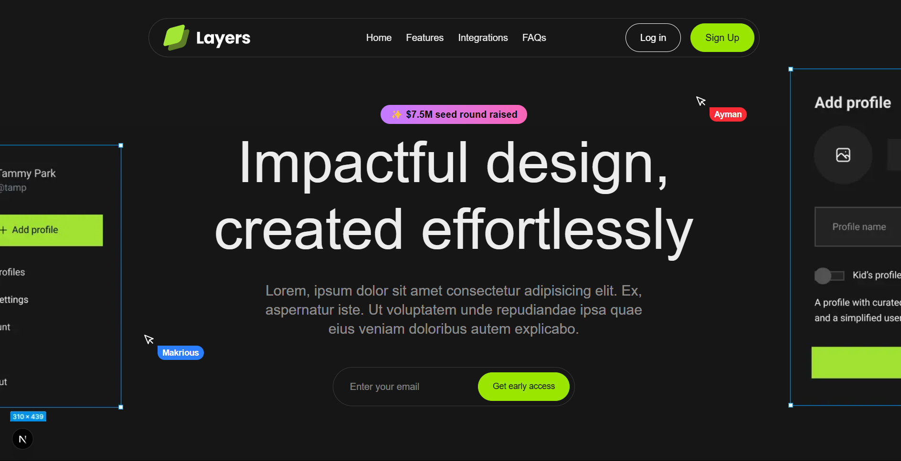

# SaaS Landing Page - Frontend Project

This is a modern, responsive SaaS landing page built using **Next.js**, styled with **Tailwind CSS**, and animated using **Framer Motion**. It serves as a professional landing page for a Software as a Service (SaaS) product.

## 🚀 Project Purpose

The project was created as a hands-on learning experience to strengthen my frontend development skills. With guidance from a YouTube tutorial, this project represents my first complete frontend website and serves as a foundation for tackling more complex web applications in the future.

## 🛠️ Tech Stack

- **Framework**: [Next.js](https://nextjs.org/)
- **Styling**: [Tailwind CSS](https://tailwindcss.com/)
- **Animations**: [Framer Motion](https://www.framer.com/motion/)

## 📁 Project Structure

The project is organized into reusable components and larger sections for maintainability:

```
components/
  ├─┐ Avatar.tsx
  ├─┐ CustomButton.tsx
  ├─┐ FeatureCard.tsx
  ├─┐ IntegrationColumn.tsx
  ├─┐ KeyboardKey.tsx
  ├─┐ Pointers.tsx
  └─┐ Tag.tsx

sections/
  ├─┐ CallToAction.tsx
  ├─┐ Faqs.tsx
  ├─┐ Features.tsx
  ├─┐ Footer.tsx
  ├─┐ Hero.tsx
  ├─┐ Integrations.tsx
  ├─┐ Introduction.tsx
  ├─┐ LogoTicker.tsx
  └─┐ Navbar.tsx
```

- **components/**: Small, reusable UI elements like buttons, avatars, and tags.
- **sections/**: Larger page sections like the Hero, Features, and Footer.

## ✨ Features

- Fully responsive design
- Smooth animations using Framer Motion
- Tailwind CSS for rapid styling
- Modular and reusable component-based structure

## 📚 Learning Experience

This project helped me understand:
- Component-based architecture with React/Next.js
- Responsive design with Tailwind CSS
- Animation handling with Framer Motion
- File structure and code modularity best practices

## 📸 Preview



## 🔗 Live Demo

Coming soon...

## 🧠 Future Plans

- Add form handling and validation
- Integrate with backend or CMS
- Explore TypeScript best practices more deeply
- Implement dark mode

---

Thanks for checking out my project! Feel free to leave feedback or suggestions to help me grow as a frontend developer.

